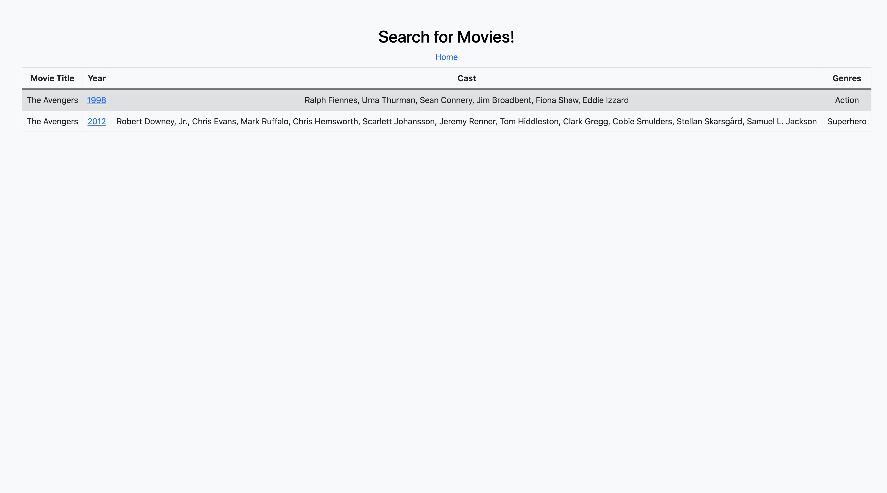
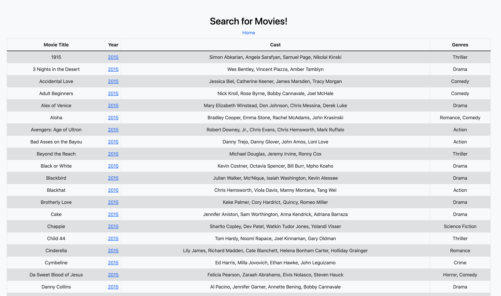
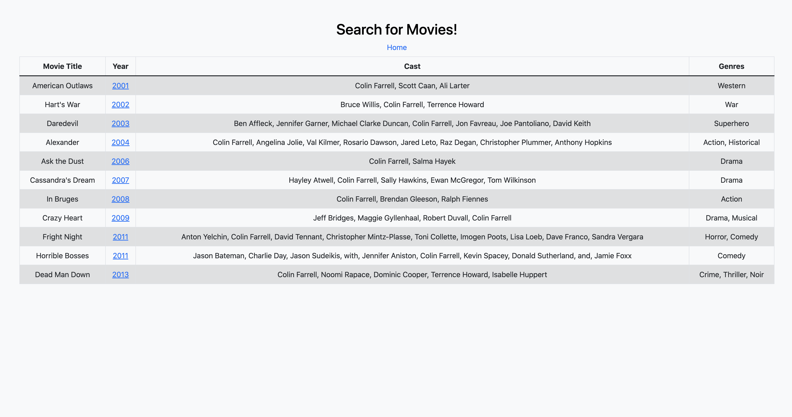
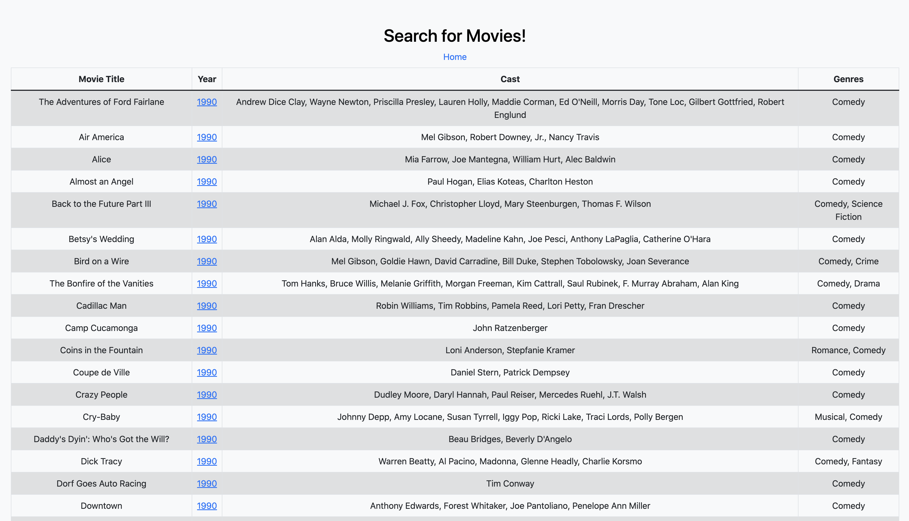

# CS103a CP02

- Creator: Qing Liu 
- Heroku link: https://secure-ravine-60727.herokuapp.com/
- Video:

## Installation
Download the project from github and download nodejs and npm from https://nodejs.org
and cd into the folder

Install the packages with
``` bash
npm install
```
Start the project with
``` bash
node app.js
```
or install nodemon (the node monitoring app) with
``` bash
npm install -g nodemon
```
and start the project with
``` bash
nodemon
```

## Screenshots 
- Main search page

- About page

- Search by title

- Search by year (the screenshot shows movies from the year 2015)

- Search by actor (the screenshot shows movies with my favorite actor, Colin Farrell!)

- Search by genre(the screenshot shows comedy movies)


